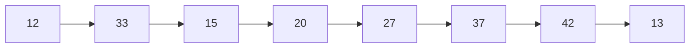

# 分布式系统定义

由多个通过**网络互联**的独立自治的**计算节点**组成。这些计算节点基于**消息传递机制**进行**互相协作**，已完成共同的目标

从用户来看，分布式系统是计算结点内聚在一起的一个整体 

计算节点：计算机、进程 、线程、虚拟机、有限状态机

独立自治：每个节点有自己的CPU、时钟

消息传递：并非内存共享模型

节点没有公共状态、必须通过消息协作。通信复杂度是影响效率重要因素。设计时必须应对局部失效、消息延迟/丢失错误

不同层次的并行运算

指令集并行、CPU多核并行、多CPU并行（一致性/非一致性内存访问）、GPU并行、多机并行（消息传递）

# 目的

1. 提高计算能力
2. 提高存储能力
3. 提高网络吞吐能力
4. 提高可靠性
5. 提高安全性
6. 提高可用性
7. 实现资源共享
8. 实现跨越时空的协同服务

可扩展性（垂直、水平）

容错性：可用性、可恢复性

透明性：访问、节点、迁移、复制、并发、伸缩、错误、性能、移动

开发性

安全性

可维护性

# 挑战

异构性：软硬件差异

自治：独立时指、内部

局部视图

开放性：数目在变动，网络在变动

可扩展性

故障处理

安全性

透明性

服务质量保证

# 节点染色

相邻颜色不同

Repeat forever：

- Send message c to all neighbours

- Receive message from all neighbours. Let M be the set of message received.

- $If\ c \notin \{1,2,3\}\ \and\ c > max\ M: $

  $Let\ c \leftarrow min(\{1,2,3\}-M)$     

# 数据库备份

分布式一致性：Paxos协议、Raft协议

一致性：严格一致性、强一致性（顺序一致性、线性一致性）、弱一致性、最终一致性

# 事件驱动技术

事件驱动器（选择器）同时监视多个Channel（Socket）

适合处理大量短事务

# RPC

远程过程调用

应用程序可以像调用本地节点上的过程(子程序) 那样去调用一个远程节点上的子程序。

同步调用

远程方法调用RMI

面向对象，调用对象方法。方法的参数可能是远程。不严格区分RMI，RPC

RPC/RMI中间件

stub桩代码/proxy代理：调用者

skeleton骨干：被调用者

二者利用socket通信

接口定义语言IDL：跨编程语言

gRPC Google开源RPC中间件

通信协议基于HTTP协议，对象序列化基于ProtoBuf序列化协议

Protobuf

1. .proto文件
2. 代码生成工具根据proto生成所有要序列化对象的工厂类
3. 将工厂类源代码增加到自己的应用
4. 需要可序列化对象时，用工厂对象创建
5. 调用对象的writeTo方法将对象序列化
6. 工厂对象parseFrom可以反序列化

工厂

gRPC

1. .proto
2. Protobuf生成要序列化的工厂类
3. gRPC生成RPC的stub和skeleton
4. 将源程序加入
5. 服务端实现skeleton核心逻辑 监听服务器
6. 客户端实现

# web service

1. HTTP传输层协议
2. 将多个第三方服务集成
3. 客户端-服务器
4. 实现面向服务构架SOA Service-oriented(以...为方向) Architecture
5. 包含XML HTTP SMTP TCP YDP SOAP WSDL 

服务端

1. 定义Web服务接口
2. 生成WSDL 
3. 实现web服务类
4. web服务类绑定web服务器
5. web服务注册UDDI中心

客户端

1. 根据UDDI查找接口定义WSDL
2. 根据WSDL生成Web服务代理类
3. 根据Web服务代理类调用

# 中间件

1. 降低耦合度
2. 提高容错
3. 提高拓展性

# 消息中间件

异步通信：发送发任意时刻发送，不必接收方上线。接收方不必阻塞方式等待

节点通过虚拟总线相连

消息队列通信模式：生产者消费者

消息一旦取走，从队列删除

出队按照负载均衡策略

主题/订阅通信模式

多个订阅同一主题消费者可以同时接受

广播组播

ActiveMQ

# 分布式存储

提高存储量、吞吐量（水平可拓展）

提高可靠/用性 （容错性）

降低访问延时（CDN）

提高效率

多副本

1. 硬件成本
2. 一致性

分区partition与切片shard

1. 跨区查询
2. 合理、动态分区
3. 负载均衡
4. 分布式事务处理

基于领导者的复值 active/passive，master/slave，primary/backup

读多写少。写数据发送给领导者，领导者发给其他。客户可以通过追随、领导查询

同步复制：确定所有从节点都写入，才完成写入

异步复制：不等待从节点，主节点写完后，确认写完

混合复制

流水线（HDFS）：大文件拆分 （滑动窗口

主从复制更新命令的级别

高级别（如SQL命令）

低级别（如CPU指令）

中级别（如数据库更新日志中的数据更新指令） 效率实现复杂度的平衡点，更容易实现原子操作

多副本一致性

1. 多客户端同时读写
2. 分布式存储节点网络不可靠
3. 部分存储节点失效

1. 强一致性：线性一致性/原子一致性（多个线程访问一个寄存器）
2. 顺序一致性
3. 因果

# CAP定理

•Consistensy(一致性)：不同节点上数据的强一致性

•Partition Tolerance(割断容忍性)：允许部分节点与其它节点断裂

•Availability(可用性)：发出的请求在规定时间段内总能返回结果（请求响应延时短，可用性高；否则可用性低）

三者取二

# BASE理论

对CAP一致性 可用性权衡的结果

基本可用（Basically Available）：在出现故障的时候，允许损失部分可用性，保证核心可用。

软状态（Soft State）：允许系统中的数据存在中间状态，允许系统在多个不同节点的数据副本存在更新延时。

最终一致性（Eventually Consistent）：不可能一直处于软状态，在一定期限后应当保证所有副本保持数据一致性，从而达到数据的最终一致性

# 数据分区

避免出现偏斜(skew)和热点(hot spot)问题。

根据主键范围进行分区

根据主键的哈希值进行分区

理想哈希函数的特性：

①确定性：相同的输入会产生相同的输出；

②随机性

③无碰撞性

根据主键的哈希值分区

将哈希空间均匀分成k个桶

计算哈希，哈希落入哪个桶

增加/删除时会大量移动

一致哈希

桶数量的改变平均只需对K/n个关键字重新映射

均衡

单调：旧桶不会互相转移

1. 理想哈希

2. 首尾练成环

3. 每个桶有唯一id

4. 每个点的标识作为hash输出，将其映射到环，产生n个点

5. 桶ID i就是hash（ID i）到下一点之间

分布式文件系统：多个节点整合在一起，用户无需关注数据在哪个节点

# HDFS 

开源分布式文件系统

主从架构 单个NameNode NN 和 多个DataNode DN 组成

高容错，高吞吐量，大文件支持（大小应为GB-TB），简单一致性模型（一次写多次读，支持内容追加，不能任意增加）

数据块有全局唯一编号

读数据：

1. 客户端发请求给NN，包含文件名、偏移量、长度
2. NN根据文件名、偏移量查找 文件名-数据块表、数据块-物理节点表，将节点IP发给客户端
3. 从客户端从IP选择最近的节点

写数据：

1. 客户端发请求给NN，NN根据负载均衡选3个点，将IP返回客户端
2. 客户端将3个点构成流水线，将第一个数据库数据流写入流水线
3. 第一个数据块写入成功后 客户端再想NN获取下三个节点

# NoSQL

非关系模型：Key-Value，列存储（Hbase）、文档模型、图模型、对象模型

牺牲一致性，放弃复杂查询，增加数据冗余，放弃复杂事务支持

可拓展 高可用性 高性能

# Hbase 

构建在HDFS上面向列的分布式数据库

稀疏表，支持随机读写，HBase管理多张分布存储多个节点的大表

每行都有Row Key 每个表的RowKey列建立分布式索引，根据RowKey快速访问行，支持指定RowKey取值范围查询

HBase大表按RowKey连续取值范围分为多个子表，由不同服务器

支持横向拓展，同一个列族的字段聚合存储在相同文件，查询同一列族速度很快

只支持行级事务，单行读写原子，不支持RowKey以为建立索引，不支持多表查询

# MapReduce

将计算任务划分多个子任务，输入文件划分数量相等的分片。一个子任务处理一个分片。最后合并

Map阶段，聚集混洗阶段，Reduce阶段

Map：输入划分多个分区，每个分区交给一个子任务。输出<key,value>

聚集混洗：不同Map输出的<key,value>,聚集成 <k1,[v1,v2..]>,<k2,[v3,v4,…]>

Reduce：将聚集数组划分，根据输入生成<key,value>

可以新一轮

单词统计

Hadoop MapReduce Job

输入文件分片

针对每个分片建立Map Task

二次分片，将Task产生<key,value>二次分片

排序

局部聚合

暂存hdfs

创建n个Reduce Task

Reduce

# Spark

DAG有向无环图 RDD与其他RDD关系，计算任务可表示为DAG

RDD只读的数据集合，可由外部数据，也可由其他RDD

Transformation算子

RDD转换新RDD

惰性执行

Action算子

RDD结果返回本地或hdfs

立即执行
